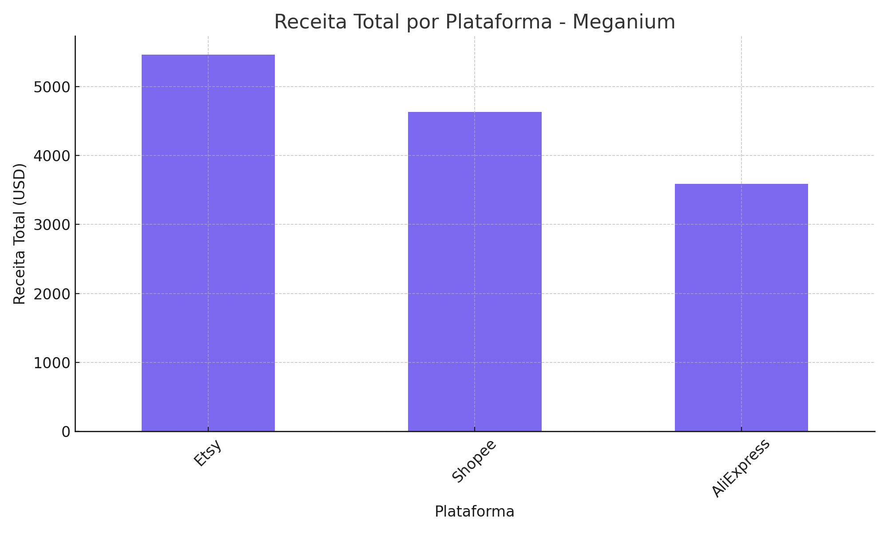

# 📈 Resumo de Insights Obtidos com IA

A partir da análise dos dados de vendas fornecidos e da aplicação dos prompts com inteligência artificial, foram identificados os seguintes insights estratégicos:

---

## 🔝 Produtos Mais Vendidos

- O produto **Anbernic RG351MP** apresentou o maior volume de vendas, com destaque na plataforma Shopee.
- Outros produtos com grande saída incluem:
  - RG35XX
  - Miyoo Mini Plus
  - FunKey S

Esses produtos também contribuíram significativamente para o faturamento total.

---

## 🛒 Performance por Plataforma

- **Shopee** apresentou o maior volume de vendas entre as plataformas, com crescimento consistente mês a mês.
- **AliExpress** mostrou melhor ticket médio por venda.
- **Etsy** teve menor volume, mas boa taxa de conversão em vendas de nicho.

> *O gráfico acima mostra que, em termos de receita total, o destaque vai para o Etsy, seguido por Shopee e AliExpress. Essa informação é essencial para priorização de estratégias de investimento e marketing por canal.*

---

## 📊 Tendências Temporais

- Os meses com maior volume de vendas foram **novembro e dezembro**, indicando influência de campanhas como Black Friday e Natal.
- Vendas mais fracas foram observadas em **janeiro e fevereiro**.

---

## 👤 Perfil do Cliente

- A maioria dos clientes realiza compras únicas, mas há um percentual pequeno e fiel que retorna para novos pedidos — especialmente nos produtos com versões atualizadas.
- Produtos com maior frequência de recompra: **RG35XX** e **cartões de memória com jogos prontos**.

---

## 💡 Ações Estratégicas Sugeridas

1. **Campanhas direcionadas** para novembro e dezembro com foco nos best-sellers.
2. Investir em **anúncios pagos para Shopee**, mantendo o destaque dos modelos mais vendidos.
3. Criar **combos de produtos** para aumentar o ticket médio (ex: console + cartão com jogos).
4. **Explorar público fidelizado** com ofertas de versões atualizadas e acessórios.

---

Esses insights foram gerados com apoio de IA utilizando prompts bem estruturados e podem servir de base para decisões de marketing, estoque e precificação.
